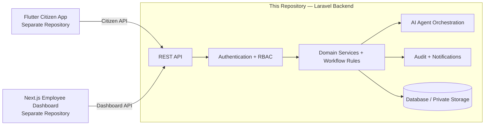
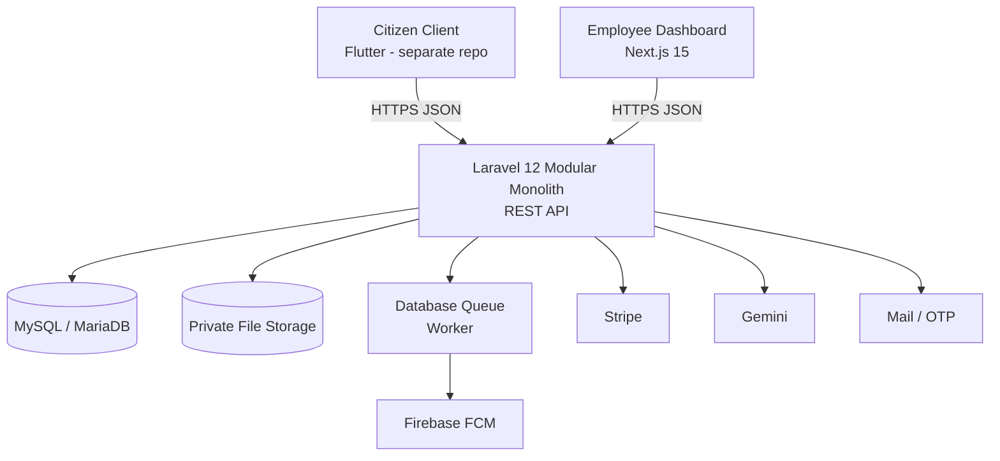
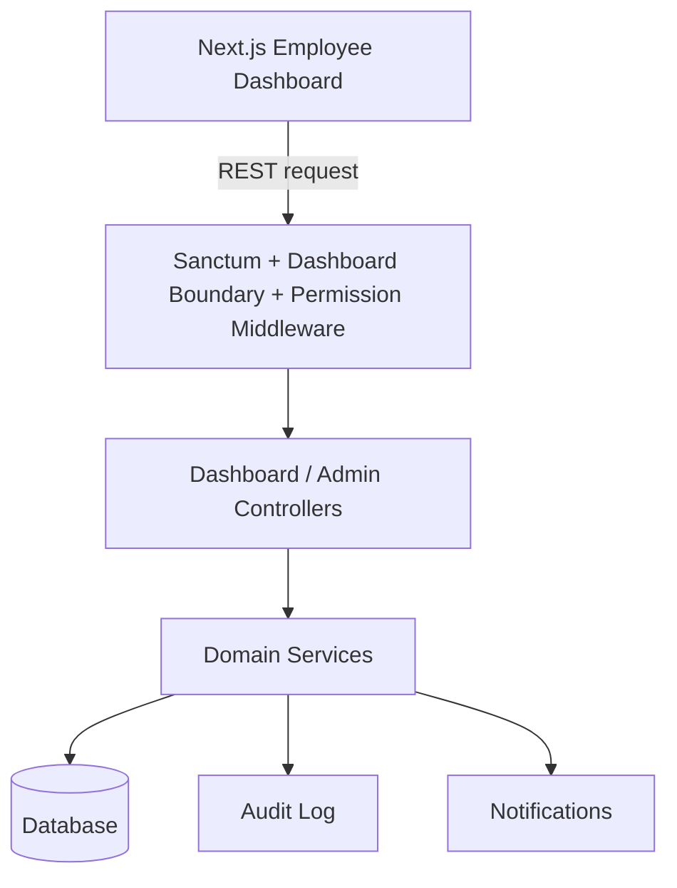
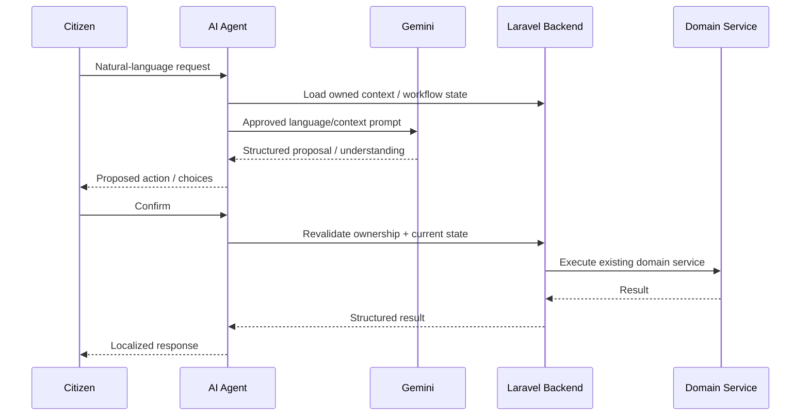
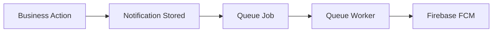

🚦 SYRTAK | DLMS — Backend

Digital License Management System · Laravel REST API

The backend authority behind SYRTAK — a government-style digital driving-license platform built around controlled workflows, security boundaries, auditability, reliability, and a confirmation-based AI assistant.

> **Repository scope:** this repository contains the **Laravel backend/API**.  
> The **Next.js employee dashboard** and **Flutter citizen application** are separate clients that consume this API.

Laravel
PHP
MySQL
Sanctum
Gemini
Stripe
Firebase
Tests
Architecture

</div>

────────

Overview

SYRTAK / DLMS is an end-to-end software engineering project for digitizing driving-license services and regulatory workflows.

This repository contains the Laravel modular-monolith REST API that acts as SYRTAK’s trusted backend authority. It centralizes the domain rules for citizen onboarding, profile approval, license applications, document review, payments, appointments, examinations, license issuance and lifecycle services, fines, notifications, audit logs, employee operations, reporting, and the controlled AI Agent.

The UI clients are intentionally outside this repository. The backend exposes citizen APIs to the Flutter application and permission-aware administrative APIs to the separate Next.js employee dashboard.

The system is designed around one principle:

> **Clients request actions; the backend remains the final authority for identity, permissions, ownership, workflow state, and business rules.**

SYRTAK is not a collection of disconnected CRUD screens. The main licensing process is implemented as a controlled workflow whose transitions are driven by domain services and verified through automated tests.

────────

Explore the Backend

|🧭 Domain                |🔐 Trust                   |🤖 Intelligence                    |🧪 Evidence                |
|------------------------|--------------------------|----------------------------------|--------------------------|
|Applications & documents|Sanctum + RBAC            |Gemini-assisted Agent             |1058 passing backend tests|
|Payments & appointments |Ownership + state guards  |Confirm before mutation           |Security negative testing |
|Tests & licenses        |Audit + integrity controls|Revalidate before execute         |k6 performance evidence   |
|Dashboard operations    |Private storage + limits  |Domain services stay authoritative|Reliability/audit evidence|

────────

What SYRTAK Includes

|Surface                       |Responsibility                                                                                                                                                                                                                                |
|------------------------------|----------------------------------------------------------------------------------------------------------------------------------------------------------------------------------------------------------------------------------------------|
|**Citizen API**               |Registration, email OTP verification, profile, applications, documents, payments, appointments, tests, licenses, fines, notifications, localization, AI Agent                                                                                 |
|**Employee Dashboard Backend**|Permission-aware REST APIs for operational queues, citizen/profile review, document decisions, applications, payments, appointment slots, test operations, license issuance/lifecycle, fines, RBAC, reports, audit logs, settings and sessions|
|**Employee Web Dashboard**    |Separate **Next.js 15** repository/client; presentation lives there, while authorization and administrative business rules remain enforced here                                                                                               |
|**Citizen Mobile Client**     |Flutter client maintained separately from this backend repository                                                                                                                                                                             |
|**AI Agent**                  |Gemini-assisted conversational layer with deterministic workflow controls and confirmation before mutations                                                                                                                                   |
|**External Integrations**     |Stripe, Firebase FCM, mail/OTP, queue workers and private file storage                                                                                                                                                                        |

────────

Repository Boundary



Important: the dashboard UI does not live in this repository. Its backend logic does: permissions, review decisions, application transitions, payment verification, test-result recording, license operations, reporting, auditability and other administrative rules are enforced by this Laravel API.

────────

Key Engineering Highlights

• Workflow-centric domain model for the driving-license lifecycle
• Custom RBAC with roles, direct permissions and separation of duties
• Citizen ownership / IDOR protection on private resources
• Service-layer business rules with selective repositories
• Database transactions, locks, idempotency and uniqueness constraints
• Private document handling
• Mock + Stripe payment flows, webhook handling and reconciliation
• Ordered driving tests: Vision → Theory → Practical
• License issuance, renewal, lost/damaged replacement, block/unblock and public verification
• Database notifications + Firebase FCM push pipeline
• Hybrid Gemini AI Agent using proposal → confirmation → revalidation → domain execution
• Arabic / English citizen-facing backend behavior
• Audit trail for critical employee/admin operations
• Docker / Compose packaging + queue worker
• Automated feature, integration, security, authorization and reliability testing
• k6 performance measurements with a fixed benchmark dataset

────────

Architecture



Backend shape

```text
HTTP Request
    ↓
Middleware / Authentication / Permission / Locale
    ↓
Controller
    ↓
Domain Service
    ↓
Selective Repository / Eloquent
    ↓
Database + Audit + Notifications + External Integrations
```

The architecture is intentionally a modular monolith, not microservices. Domain modules are deployed as one Laravel application while keeping responsibilities separated inside the codebase.

────────

Main Domain Modules

The backend contains 18 domain/application modules under app/Modules/.

|Module         |Responsibility                                                                                        |
|---------------|------------------------------------------------------------------------------------------------------|
|`Auth`         |Registration, email OTP, login/logout, password flows and citizen profile                             |
|`Applications` |License service requests, eligibility, documents and application lifecycle                            |
|`Appointments` |Appointment slots, booking, rescheduling, cancellation and capacity protection                        |
|`Payments`     |Mock/Stripe payment lifecycle, webhook handling and reconciliation                                    |
|`Licenses`     |Issuance, renewal, replacement, blocking/unblocking, printing and public verification                 |
|`Dashboard`    |Employee dashboard APIs, citizens, applications, payments, slots, fees, licenses, reports and sessions|
|`Admin`        |Profile/document review, test result recording, issuance, fines and administrative operations         |
|`AIAgent`      |Gemini-assisted intent/workflow orchestration and confirmed actions                                   |
|`Notifications`|In-app notification center and notification events                                                    |
|`Devices`      |Citizen push-device registration                                                                      |
|`Push`         |Push delivery pipeline                                                                                |
|`Firebase`     |FCM integration                                                                                       |
|`Fines`        |Citizen fine listing and administrative fine operations                                               |
|`Reports`      |Administrative reporting                                                                              |
|`Settings`     |Citizen preferences including locale-related settings                                                 |
|`Content`      |FAQ, privacy/contact content and messages                                                             |
|`Tests`        |Test-related application services                                                                     |
|`AuditLogs`    |Audit-log API resources and access                                                                    |

────────

Actors & Access Model

Citizen

Citizens can:

• register and verify their account using email OTP
• complete and update their profile
• submit supported driving-license service applications
• upload and submit required documents
• pay application obligations through mock or Stripe flows
• book, reschedule and cancel eligible appointments
• view test progression and results
• view issued licenses and supported license lifecycle services
• view fines
• receive in-app and optional push notifications
• use the AI Agent in Arabic or English

Employee roles

Employee capabilities are permission-driven rather than controlled by a single all-powerful employee role.

Representative roles include:

• Profile & Document Reviewer
• Application Manager
• Payment Employee
• Test Employee
• License Employee
• Fines Employee
• Reports Employee
• Audit Employee
• Settings Employee
• Admin
• Super Admin

The project uses a custom RBAC implementation with role permissions and optional direct permissions.

────────

Employee Dashboard Backend

The employee dashboard is a separate Next.js client, but its trusted operational logic is implemented in this backend.



Representative backend capabilities exposed to the dashboard include:

|Area                    |Backend responsibility                                              |
|------------------------|--------------------------------------------------------------------|
|**Operational overview**|Dashboard metrics, queues and actionable operational data           |
|**Citizen profiles**    |Review/decision flows with permission and state enforcement         |
|**Documents**           |Review queues, approve/reject decisions and rejection reasons       |
|**Applications**        |Search, details, workflow/state-aware employee operations           |
|**Payments**            |Payment inspection, verification and reconciliation operations      |
|**Appointments**        |Slot administration and operational appointment management          |
|**Tests**               |Authorized result recording and test workflow progression           |
|**Licenses**            |Eligibility checks, issuance, block/unblock and lifecycle operations|
|**Fines**               |Authorized fine administration                                      |
|**RBAC**                |Employees, roles, permissions and direct permission controls        |
|**Reports**             |Administrative reporting endpoints                                  |
|**Audit**               |Readable evidence of critical administrative actions                |
|**Settings**            |Catalog/configuration operations protected by permissions           |
|**Sessions**            |Administrative session management where supported                   |

The frontend can hide unavailable actions for usability, but the backend independently re-enforces authorization, ownership/state rules and workflow legality. A dashboard button is never treated as an authorization boundary.

────────

Driving-License Workflow

New license

```mermaid
flowchart LR
    A[Approved Citizen Profile]
    B[Draft Application]
    C[Upload Required Documents]
    D[Documents Under Review]
    E[Payment Pending]
    F[Payment Completed]
    G[Appointment / Testing]
    H[Vision]
    I[Theory]
    J[Practical]
    K[Approved]
    L[License Issued]

    A --> B --> C --> D --> E --> F --> G
    G --> H --> I --> J --> K --> L
```



The test sequence for a new license is enforced as:

1. Vision
2. Theory
3. Practical

Failed/no-show outcomes are handled by the test workflow and may lead to retest or administrative review according to the current domain rules.

Other service codes

The implemented service catalog includes:

```text
new_license
renew_license
lost_replacement
damaged_replacement
license_unblock
```

Renewal and replacement flows are tied to an existing citizen-owned license. They do not reuse the full new-license test sequence.

────────

Application State Model

The active workflow uses states including:

```text
draft
    ↓
documents_under_review
    ├── documents_rejected ──→ resubmit
    ↓
payment_pending
    ↓
payment_completed
    ↓
appointment_pending / approved
    ↓
in_testing
    ├── waiting_retest
    ├── administrative_review
    ↓
approved
    ↓
license_issued
```

> `rejected` and `cancelled` exist as application enum values, but the current audited backend does not treat them as generally proven live production transitions.

The application repository records status history, but the project does not currently use one global central FSM matrix for every legal/illegal transition. Workflow legality is primarily enforced by the responsible domain services.

────────

Documents

Document handling is state-aware and ownership-aware.

The backend validates:

• document applicability to the requested service
• file size limits
• allowed file types
• MIME/type rules
• application ownership
• whether the current application/document state permits replacement or submission

Citizen documents are stored on private storage and are not exposed through public filesystem URLs.

Supported upload formats are based on the current document rules, including:

```text
PDF
JPG / JPEG
PNG
```

Exact size limits may be further restricted by the required-document configuration for the selected service.

────────

Payments

SYRTAK supports two payment paths:

Mock provider

Used for development and controlled testing.

Stripe

The real integration path includes:

• Stripe Checkout/session creation
• payment records and lifecycle state
• webhook processing
• provider-event uniqueness / idempotency protection
• dashboard verification/reconciliation logic

The system does not store raw card data.

> Citizen fine checkout is not currently presented as a completed payment flow; citizens can view fines while fine administration is handled by authorized employees.

────────

Appointments & Tests

The appointment subsystem supports:

• available slot listing
• booking
• rescheduling
• cancellation
• capacity checks
• state validation
• stale-state protection

Concurrency-sensitive booking logic uses database locking where appropriate.

Test results are recorded by authorized employees and feed the application workflow.

────────

License Lifecycle

Implemented license capabilities include:

• issuance from an eligible application
• citizen license listing/details
• renewal
• lost replacement
• damaged replacement
• employee block / unblock
• print/export support
• public license verification

Public verification is intentionally separated from privileged administrative operations.

────────

AI Agent

The original rule-based chatbot concept was replaced by a hybrid transactional AI Agent powered by Gemini.



Safety model

The AI Agent:

• is citizen-only
• does not get direct database authority
• does not decide employee permissions
• cannot approve documents, record official test results, issue licenses or perform administrative actions
• requires explicit confirmation before supported mutations
• revalidates mutable state before execution
• protects session/action/application ownership
• rejects stale, foreign, replayed or invalid confirmation flows
• executes through the same existing domain services as manual API flows
• does not send uploaded document binary/content, private paths, tokens or secrets to Gemini
• has deterministic fallback behavior for supported flows

AI scope

The Agent supports citizen-oriented queries and workflows across applications, documents, payments, appointments/tests, licenses and fines within its implemented executable scope.

It is not:

• an unsupervised autonomous agent
• a replacement for backend business rules
• a RAG/vector-database system
• an employee/admin automation channel

────────

Localization

Citizen-facing backend behavior supports:

• Arabic
• English
• request locale resolution
• persisted citizen preference
• localized validation/service messages
• bilingual AI Agent flows
• language switching during supported AI sessions

Internal machine codes, enum values and workflow identifiers remain language-neutral.

The employee dashboard is currently treated as an Arabic RTL dashboard; this repository does not claim a fully bilingual dashboard UI.

────────

Notifications

SYRTAK contains two notification layers:

In-app notification center

Notifications are persisted and can be listed/read by the citizen.

Push notifications

The push pipeline includes:



Push delivery can be enabled/disabled through environment configuration without changing the core business transaction.

────────

Security

Security is enforced primarily on the backend.

Core controls include:

• Laravel Sanctum bearer-token authentication
• citizen/dashboard boundary middleware
• custom RBAC and permission middleware
• inactive-user checks
• ownership scoping
• profile-approval guards
• private file storage
• validation through request/domain rules
• rate limits on representative sensitive routes
• audit logging for critical operations
• transactions and database constraints for sensitive state changes

Measured security evidence

Evidence snapshot:

|Metric                          |Result      |
|--------------------------------|-----------:|
|Unauthenticated `401` scenarios |**26**      |
|Unauthorized `403` scenarios    |**95**      |
|Negative IDOR scenarios         |**21**      |
|Critical mutation `403` coverage|**13 / 13** |
|Critical mutation `401` coverage|**7 / 13**  |
|Positive `429` rate-limit tests |**4 routes**|

These are automated evidence counts for the audited scope; they are not a penetration-test certification or a claim of complete security.

────────

Reliability & Data Integrity

The backend uses several layers of protection for sensitive workflows:

• DB::transaction
• pessimistic locking (lockForUpdate) where needed
• optimistic conflict handling in selected domains
• idempotency / duplicate-effect protection
• unique database invariants
• payment event uniqueness
• stale-state revalidation
• after-commit handling for selected side effects

Evidence snapshot:

|Metric                                  |Result                          |
|----------------------------------------|-------------------------------:|
|Idempotency-related methods inventoried |**36**                          |
|Critical DB uniqueness invariants tested|**12 / 12**                     |
|Critical auditable operations           |**36 / 36 implemented + tested**|

Concurrency evidence is intentionally scoped; sequential PHPUnit tests are not presented as proof that the entire platform is globally race-free.

────────

Auditability

Critical employee/admin operations are recorded through the audit infrastructure.

Examples include:

• employee/account administration
• role and permission changes
• citizen activation/deactivation
• profile decisions
• document decisions
• payment verification
• fine mutations
• appointment-slot changes
• test result recording
• license issuance/block/unblock
• fee/catalog administration

Evidence inventory records 36/36 critical operations with audit implementation and automated verification.

────────

Performance Evidence

Performance measurements were executed with Grafana k6 against a controlled local benchmark environment using a fixed dataset.

Infrastructure baseline

GET /api/ping

|Metric        |Result       |
|--------------|------------:|
|Requests / 60s|10,203       |
|Throughput    |170.044 req/s|
|Median        |5.72 ms      |
|p95           |6.63 ms      |
|p99           |7.36 ms      |
|HTTP errors   |0%           |

Authenticated applications workload

GET /api/dashboard/applications

|Virtual Users|Requests|req/s|p95     |p99      |Failures|
|------------:|-------:|----:|-------:|--------:|-------:|
|10           |590     |9.64 |42.16 ms|54.67 ms |0%      |
|25           |1,450   |23.92|55.97 ms|80.47 ms |0%      |
|50           |2,944   |48.08|62.91 ms|109.07 ms|0%      |
|100          |5,842   |95.36|65.76 ms|212.17 ms|0%      |

> These are **controlled local paced measurements**, not a production-capacity or scalability guarantee.

Unpaced saturation experiments were retained as environment diagnostics and are not used as capacity claims.

────────

Automated Testing

The recorded final backend regression baseline is:

```text
Tests:       1058 passed
Assertions:  6694
Failures:    0
Duration:    258.15 s
```

Run the backend suite with:

```bash
php artisan test
```

AI-focused regression:

```bash
php artisan test --filter=AIAgent
```

The backend test suite covers functional workflows, authorization, ownership, security negatives, payments, appointments, tests, license operations, AI Agent safety, localization, reliability and evidence hardening.

> Automated Next.js dashboard test coverage is not claimed by this repository.

────────

Evidence Snapshot

The repository’s final report/evidence set records the following audited baseline:

```text
Backend regression : 1058 tests passed
Assertions          : 6694
Failures            : 0
401 scenarios       : 26
403 scenarios       : 95
Negative IDOR       : 21
Audit coverage      : 36 / 36 critical operations
Paced 100-VU run    : 5842 requests · 0% failures · p95 65.76 ms
```

These figures describe the measured scope and environment only. They are not presented as production SLA, penetration-test certification, or global scalability guarantees.

────────

Technology Stack

|Layer                |Technology                            |
|---------------------|--------------------------------------|
|Backend              |Laravel **12.66.0**                   |
|Runtime              |PHP **8.4.24**                        |
|Dependency Manager   |Composer **2.10.2**                   |
|API                  |REST / JSON                           |
|Authentication       |Laravel Sanctum                       |
|Database             |MySQL / MariaDB                       |
|Test Database        |SQLite may be used by PHPUnit         |
|Authorization        |Custom RBAC + direct permissions      |
|Employee Web Client  |Next.js 15, React, TypeScript         |
|Citizen Mobile Client|Flutter — separate repository         |
|AI                   |Google Gemini                         |
|Payments             |Stripe + Mock provider                |
|Notifications        |Database notifications + Firebase FCM |
|Queue                |Laravel database queue                |
|Containerization     |Docker / Docker Compose               |
|Process Supervision  |Supervisor                            |
|Testing              |PHPUnit / Laravel Feature & Unit tests|
|Performance          |Grafana k6                            |

────────

Repository Structure

```text
app/
├── Enums/
├── Models/
└── Modules/
    ├── Admin/
    ├── AIAgent/
    ├── Applications/
    ├── Appointments/
    ├── AuditLogs/
    ├── Auth/
    ├── Content/
    ├── Dashboard/
    ├── Devices/
    ├── Fines/
    ├── Firebase/
    ├── Licenses/
    ├── Notifications/
    ├── Payments/
    ├── Push/
    ├── Reports/
    ├── Settings/
    └── Tests/

config/
database/
├── migrations/
└── seeders/

routes/
├── api.php
├── console.php
└── web.php

tests/
├── Feature/
├── Unit/
└── performance/

docs/
└── evidence/
```

────────

API Surface

This README intentionally lists API families rather than every route. Use Laravel route inspection and the maintained Postman collection for the exact contract.

```bash
php artisan route:list
```

Representative API families:

```text
/api/auth/*
/api/profile/*
/api/applications/*
/api/licenses/*
/api/fines/*
/api/notifications/*
/api/devices/push-token
/api/ai-agent/*
/api/dashboard/*
/api/admin/*
/api/webhooks/stripe
```

Public endpoints include catalog/content surfaces and license verification where configured.

────────

Installation

Requirements

• PHP 8.4+
• Composer
• MySQL / MariaDB
• required PHP extensions for Laravel and the configured database
• optional: Docker / Docker Compose

1. Clone

```bash
git clone <repository-url>
cd DLMS_Project
```

2. Install PHP dependencies

```bash
composer install
```

3. Configure the environment

```bash
cp .env.example .env
php artisan key:generate
```

Configure at minimum:

```env
APP_ENV=local

DB_CONNECTION=mysql
DB_HOST=127.0.0.1
DB_PORT=3306
DB_DATABASE=dlms
DB_USERNAME=root
DB_PASSWORD=
```

Then configure optional integration credentials according to .env.example for:

• mail / OTP
• Stripe
• Gemini
• Firebase FCM
• queue/storage settings

Never commit real secrets, access tokens or private keys.

4. Create the database schema

```bash
php artisan migrate --seed
```

For a fully reset local development database:

```bash
php artisan migrate:fresh --seed
```

5. Start the API

```bash
php artisan serve
```

Default local URL:

```text
http://127.0.0.1:8000
```

6. Start the queue worker when testing queued push delivery

```bash
php artisan queue:work
```

────────

Docker

The repository includes Docker packaging for the backend runtime.

Typical local workflow:

```bash
docker compose up -d --build
docker compose ps
```

The deployment packaging includes the Laravel application, database/runtime configuration and a supervised queue worker according to the current Compose setup.

────────

Deployment

The project has been demonstrated with separated web-client and backend deployment:

|Component         |Platform                               |
|------------------|---------------------------------------|
|Employee Dashboard|Vercel                                 |
|Laravel API       |Railway                                |
|Backend packaging |Docker / Compose                       |
|Background worker |Supervisor-managed Laravel queue worker|

The backend exposes Laravel’s health-check path:

```text
/up
```

Deployment is currently treated as a controlled manual release. This repository does not claim an implemented CI/CD pipeline or a measured availability SLA.

────────

Postman & Integration Docs

The repository contains maintained API/integration artifacts, including the citizen/Flutter Postman collection and project documentation.

Use these together with:

```bash
php artisan route:list
```

when integrating a client, because route contracts and current backend behavior take precedence over older narrative documentation.

────────

Important Business Rules

Representative domain rules include:

1. A citizen must have an approved profile before using protected mutating citizen services.
2. Duplicate conflicting active applications are blocked.
3. Required documents must satisfy service-specific rules before submission.
4. Documents are reviewed by authorized employees; rejected items can require correction/re-upload.
5. Payment operations are state-aware and duplicate settled obligations are prevented.
6. New-license testing follows Vision → Theory → Practical.
7. Appointment booking respects eligibility, state and slot capacity.
8. License issuance requires the application to satisfy the appropriate service workflow.
9. Renewal/replacement operates on a citizen-owned eligible license.
10. Citizen/private resources are ownership-scoped.
11. Sensitive employee/admin mutations are permission-protected and auditable.
12. AI mutations cannot bypass the same business rules used by normal API flows.

────────

Known Boundaries

This README intentionally avoids claims that are not supported by the current implementation/evidence.

|Topic                 |Current boundary                                                             |
|----------------------|-----------------------------------------------------------------------------|
|Architecture          |Modular monolith; **not microservices / event-driven / true AOP**            |
|Application FSM       |No single global illegal-transition matrix                                   |
|Security              |Strong automated evidence, but **no external penetration-test certification**|
|Concurrency           |Scoped protection/tests; not a global race-free guarantee                    |
|Performance           |Local paced benchmark; not production capacity                               |
|Availability          |No measured 99.9% SLA                                                        |
|AI                    |No RAG/vector database; no unsupervised mutation                             |
|Dashboard localization|Arabic RTL dashboard; full bilingual dashboard not claimed                   |
|Dashboard tests       |Automated frontend coverage not claimed                                      |
|CI/CD                 |No evidenced CI/CD workflow in the audited repository                        |
|Fine payment          |Citizen fine checkout is not claimed as complete                             |
|Flutter               |Mobile client is maintained outside this backend repository                  |

────────

Project Status

|Component                                  |Status                                                          |
|-------------------------------------------|----------------------------------------------------------------|
|**Laravel backend in this repository**     |✅ Implemented, tested and deployable within the documented scope|
|**Employee Dashboard backend APIs**        |✅ Implemented here                                              |
|**Next.js employee dashboard UI**          |↗ Separate repository/client                                    |
|**Citizen API**                            |✅ Implemented here                                              |
|**Flutter citizen UI**                     |↗ Separate repository/client                                    |
|**Gemini-assisted AI Agent backend**       |✅ Implemented with confirmation/revalidation controls           |
|**Security / reliability / audit evidence**|✅ Maintained in the project evidence set                        |
|**Performance evidence**                   |✅ Controlled k6 measurements recorded                           |

────────

Academic Context

SYRTAK is developed as a Software Engineering graduation project focused not only on building a working product, but also on:

• requirements engineering
• business-rule modeling
• UML and system design
• database design
• API contracts
• secure workflow implementation
• automated verification
• performance measurement
• deployment
• evidence-backed technical reporting

────────

License

This repository is intended for academic and educational use unless a separate repository license states otherwise.

────────

<div align="center">

SYRTAK

Digital driving-license services — engineered as one controlled workflow.

</div>